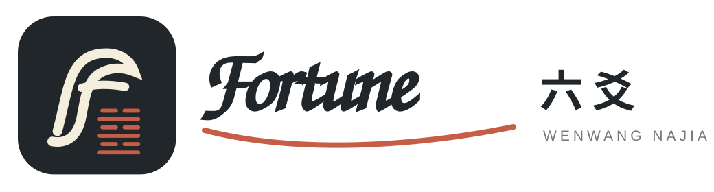

<div align="center">
  

# Fortune 六爻：AI 六爻排盘与解读 Skill

### 先把每一爻算清楚，再让大模型沿传统方法完整断盘

输入一个问题，选择自动起卦、逐次记录或三枚硬币手动起卦，生成文王纳甲六爻卦盘和完整解读。

<p>
  
  
  
  
  
  
</p>

**[核心能力](#它不只是一个占卜提示词) · [快速开始](#30-秒开始一次占问) · [手动摇卦](#自己摇硬币也可以) · [项目结构](#项目结构)**

</div>

## English summary

**Fortune Liuyao** is a self-contained Agent Skill for deterministic Wenwang Najia / Six Lines divination (`六爻`, `文王纳甲`, `京房八宫`). It calculates the original and changed hexagrams, Najia, Six Relations, Six Spirits, Shi/Ying positions, void and broken branches, moving-line transformations, hidden spirits, and auditable rule facts before an AI Agent writes the interpretation.

It works with skill-compatible desktop Agents such as OpenAI Codex, Claude Code, Cursor, WorkBuddy, and other Agent Skills hosts. One local Python command returns the chart data, interpretation prompt, standalone HTML chart, and Markdown fallback. No Fortune API, API key, web service, npm package, or external Python package installation is required.

Search aliases: **Liuyao Skill**, **Six Lines Divination Skill**, **Wenwang Najia Skill**, **I Ching Agent Skill**, **六爻排盘 Skill**, **三枚硬币起卦**, **京房八宫排盘**.

## 安装

### Agent Skills CLI

```bash
npx skills add shubhaviatiningsih-byte/fortune-liuyao-skill -g -y
```

### GitHub Release 安装包

从 [GitHub Releases](https://github.com/shubhaviatiningsih-byte/fortune-liuyao-skill/releases/latest) 下载 `fortune-liuyao.skill`，再导入支持 Agent Skills 的客户端。

### Git 安装

```bash
git clone https://github.com/shubhaviatiningsih-byte/fortune-liuyao-skill.git
```

仓库根目录就是完整 Skill，包含 `SKILL.md`、确定性脚本、参考方法和展示资源。运行环境只需 Python 3.10+；`lunar_python` 已按 MIT 许可证内置。


## 我们真正想做的事

我们并不想把六爻包装成一种能够代替现实行动的答案，也不认为多塞几本古籍，就能让占卜突然变得“绝对准确”。

六爻首先是一种占问和观察事情的方式。它可以提供另一种理解处境的角度，却不能替你参加面试、经营关系、作出投资决定，或承担现实选择的后果。

我们真正关心的是另一个更具体的问题：**既然越来越多人会让大模型解读六爻，怎样让这次解读少一点想当然，多看见一些真正重要的盘面信息？**

大模型很会组织语言，也见过大量相似内容，但它同样可能：

- 排错纳甲、六亲或世应，却继续给出一篇看似完整的解释；
- 只抓住一个醒目的动爻或卦名，遗漏用神、月日、伏神和其他作用链；
- 把模糊类象直接扩张成具体人事，写出盘面并不支持的细节；
- 给出一个听起来笃定的日期，却说不清这个时间从哪里推出来。

所以我们没有让模型从零开始“猜一张盘”。系统先用程序完成精确排盘，把用神候选、世应、月日、动变、伏神、空破、进退和生克关系逐项展开；再加载项目整理的传统观察顺序和分析方法，作为模型的思考路线；最后对输出进行事实一致性检查，尽量拦住盘面方向写反、依据遗漏和无根据扩张。

我们希望保留大模型原本擅长的综合判断和表达能力，而不是把它锁成一台机械打分器。只是让它在开口之前，**先把该看的看全，把已经算清楚的事实看准，再给出一份更接近真人断盘过程的回答。**

这未必让每一次占问都“更神准”，但会让解读更完整、更有来路，也更值得用户自己复盘。

## 它不只是一个占卜提示词

普通 AI 占卜往往把问题和几个数字直接交给模型自由发挥。这个 Skill 把容易出错、容易遗漏的部分提前做成稳定链路：

| 能力 | 它具体做什么 |
|---|---|
| **确定性排盘** | 计算本卦、变卦、八宫世应、纳甲、六亲、六神、旬空、月破与动变，不让模型猜盘 |
| **细化规则事实** | 展开伏神飞神、回头生克、进退神、冲合刑害、用神候选、多现比较和条件性应期 |
| **传统方法引导** | 按问题领域提醒模型检查用神、世应、月日、动变、伏神、原忌仇神、格局和应期条件 |
| **自由综合解读** | 不用正负计分替代断盘；模型可以运用稳定的京房纳甲知识形成有主次、有结论的报告 |

> **程序负责把盘算准，传统方法负责提醒它该看什么，大模型负责把这些线索真正连成一段判断。**

这意味着，报告仍然可以有明确倾向、有具体解释，而不是充满“也许、可能、仅供参考”的空话；与此同时，盘面基础、判断主线和时间条件也都可以回看与复核。

## 一条开箱即用的链路

```text
用户问题 + 六次起卦结果
        ↓
确定性排盘：历法 / 纳甲 / 八宫世应 / 六亲六神 / 动变伏神
        ↓
规则事实：用神候选 / 旺衰证据 / 作用链 / 应期条件
        ↓
领域方法：事业 / 财富 / 感情 / 学业 / 出行 / 住宅等
        ↓
综合判断：连接用神、世应、月日、动变与现实语境
        ↓
HTML 或 Markdown 卦盘 + 核心结论 + 判断过程 + 条件性应期
```

## 30 秒开始一次占问

从 [GitHub Releases](https://github.com/shubhaviatiningsih-byte/fortune-liuyao-skill/releases/latest) 下载 `fortune-liuyao.skill` 并安装，然后直接在 Agent 对话中提出问题。Agent 会用单选弹窗询问自动、逐爻或硬币/爻值起卦；当前客户端不支持弹窗时显示简短文字选项。问题方向、目标和期限优先从文字中理解；问题本身不足以起卦时，Agent 会先询问一个必要的澄清问题。

当前源码版只要求宿主可调用 Python 3.10+；`lunar_python==1.4.8` 已按 MIT 许可证内置。如果宿主 Agent 已内置并允许调用 Python，用户无需另外操作；完全没有 Python 运行时的电脑暂不能执行确定性排盘。可用 `python scripts/run_liuyao.py --selfcheck` 一次检查运行条件、金标盘和展示文件。

不能启动本地网页时，也可以直接告诉智能体：

```text
我想问未来三个月能不能找到合适的工作。
请用一键自动起卦，生成卦盘，并按六爻方法完整解读。
```

也可以让 Agent 逐次记录六轮结果，或把自己线下摇出的六次硬币结果一次性交给 Skill。

无需执行 `pip install`。首次运行可用以下命令检查 Python、内置历法、确定性引擎和渲染器：

```bash
python -S scripts/run_liuyao.py --selfcheck
```

返回 `READY` 后即可使用；`-S` 验证运行过程没有依赖系统 `site-packages`。

## 自己摇硬币也可以

准备三枚相同硬币，连续摇六次。**第一次是初爻，最后一次是上爻。**

本 Skill 采用正面记 3、反面记 2：

| 三枚硬币 | 爻值 | 爻象 |
|---|---:|---|
| 反反反 | 6 | 老阴 · 动爻 |
| 正反反 | 7 | 少阳 |
| 正正反 | 8 | 少阴 |
| 正正正 | 9 | 老阳 · 动爻 |

输入示例：

```text
我问未来三个月能否找到工作。
六次结果从初爻到上爻依次为：
正反反 / 正正反 / 反反反 / 正反反 / 正正正 / 正正反
```

Skill 会先回显为 `[7, 8, 6, 7, 9, 8]`，确认顺序后再排盘，避免上下爻录反。

## 一张卦盘里会算清什么

<details open>
<summary><strong>排盘事实</strong></summary>

- 本卦、变卦、卦宫、宫五行与世应；
- 逐爻纳甲、六亲、六神、旬空、月破与日月关系；
- 动爻、变爻六亲、回头生克、化进、化退、化泄与化耗；
- 伏神、飞神及伏藏状态；
- 冲、合、刑、害、六冲六合、三合与反吟伏吟等结构。

</details>

<details open>
<summary><strong>分析主线</strong></summary>

- 根据问题语义选择领域方法，并由模型结合求测关系审题取用；
- 用神多现时比较持世临应、动静、月日状态与作用链；
- 分析世爻自身、应爻环境和世应关系；
- 逐条梳理动爻到变爻，以及动爻对世爻、用神的实际作用；
- 用神伏藏时专项分析飞伏关系与出伏条件；
- 用“当前病处 → 解除条件 → 机会窗口 → 落实窗口”组织应期候选；
- 卦名、爻位和六神作为辅助取象，不取代主线判断。

</details>

## 输出更符合读者期待

默认报告不从术语堆砌开始，而按用户真正关心的顺序组织：

1. **直接判断** — 先回答能不能、倾向如何；
2. **用神与世应** — 说明事情、自己和环境各处于什么状态；
3. **关键动变** — 找出真正推动或阻碍事情的变化线索；
4. **支持与阻力** — 解释依据的主次，而不是简单正负计数；
5. **条件性应期** — 给出窗口及成立前提；
6. **现实建议** — 与盘面判断挂钩，给出可执行动作。

## 展示方式会适配当前 Agent

Skill 默认由当前电脑 Agent 在对话中完成排盘与解读；起卦方式的交互取决于宿主能力：

- 宿主支持选择控件时，显示自动、逐爻、硬币／爻值三个选项；不支持时降级为简短文字选项；
- 支持 HTML 文件产物时，生成可独立打开的可视卦盘；
- 只能返回文字时，生成结构完整的 Markdown 卦盘；
- 两种格式都保留本卦、变卦、世应、动爻、空破、伏神、变爻关系和初爻至上爻的输入顺序；
- 解读失败时，已经完成的排盘仍然可以单独查看和保存。

## 适合哪些问题

- 求职、晋升、转行与工作稳定；
- 收益、回款、合作与交易；
- 感情发展、关系缓和与复合；
- 考试、学习进展与师友选择；
- 出行、住宅、家庭关系与一般纠纷趋势。

高风险问题会在起卦前给出友善说明，并引导用户采取更可靠的现实行动。

## 常见问题

### 三枚硬币摇完以后，怎样输入六爻？

从第一次到第六次依次记录，顺序对应初爻到上爻。可以直接输入正反面组合，也可以输入换算后的 `6、7、8、9`；排盘前会先回显一次，避免上下爻录反。

### 它和让 AI 直接解卦有什么区别？

直接解卦容易把排盘和解释混在一起。这里先确定性计算纳甲、六亲、世应、旬空、动变与伏神，再根据问题加载相应分析顺序，最后才形成综合判断。

### 能用于事业、感情和财运之外的问题吗？

可以。当前方法覆盖事业、财富、感情、学业、出行、住宅、家庭关系和一般纠纷，并根据提问对象、判断目标和期限调整用神与分析重点。

### 为什么还要保留卦盘和判断过程？

因为一段听起来顺畅的文字不等于盘面正确。保留卦盘、规则事实和判断主线，用户才能看见结论从哪里来，也能在事后复盘哪些条件真正发生了。

## 可核验能力矩阵

下面只列入当前仓库脚本能够确定性计算或明确交付的能力，不把模型自由推断包装成程序能力。

| 维度 | 当前实现 | 核验入口 |
|---|---|---|
| 起卦 | 自动、逐爻交互、六次硬币/爻值输入；统一按初爻到上爻 | `cast_lines.py`、`cast_one_line.py` |
| 历法 | 起卦时刻、干支、月建、旬空、节气窗口；Asia/Shanghai 固定 UTC+8 兜底 | `run_liuyao.py --selfcheck` |
| 基础排盘 | 本卦、变卦、京房八宫、卦宫、世应、纳甲、六亲、六神 | `liuyao_core.py` |
| 动变结构 | 动爻、变爻六亲、回头生克、化进化退等确定性关系 | `liuyao_core.py` |
| 扩展事实 | 伏神飞神、空破、日冲、冲合刑害、三合结构候选 | `deterministicRuleFacts` |
| 领域分析 | Agent 语义路由到事业、财富、感情、学业、出行、住宅、家庭、纠纷或通用方法 | `domain-routing.md`、`domain-methods.json` |
| 输出 | 同一次运行生成独立 HTML 与 Markdown 卦盘 | `artifacts.html`、`artifacts.markdown` |
| 防编造 | 报告生成后审计明确盘面断言；只锁盘面事实，不限制吉凶、应期和传统推断 | `verify_facts.py` |
| 安全边界 | 对医疗诊断、生死、胎儿性别、失踪定位等高风险问题确定性分流 | `classify_sensitive.py` |
| 外部服务 | 不调用 Fortune API，不需要 API key、网页服务或联网排盘 | 本地统一入口 |

## 公开验证记录

当前公开发布版本已经完成以下检查：

- 独立回归测试：`47/47` 通过；
- 干净安装包：63 个正式文件，不包含测试目录、E2E 产物、`__pycache__` 或 `.pyc`；
- 隔离运行：`python -S scripts/run_liuyao.py --selfcheck` 返回 `READY`；
- 干净仓库实际起卦：同一次调用成功生成 HTML 与 Markdown；
- 真实 Codex Agent E2E：完成自动起卦、完整解读、双格式交付与报告事实审计，审计结果为 `accepted=true`、0 个事实错误。

测试边界：真实 Agent E2E 已覆盖自动起卦；宿主客户端特有的“连续六次选择弹窗”依赖宿主交互能力，目前由行为契约和脚本测试覆盖，尚未作为跨客户端统一 E2E 结论。

## 与 MCP/API 项目的定位区别

本仓库首先是可直接安装到桌面 Agent 的本地 Skill，不是常驻 MCP Server。它把确定性引擎、交互契约、领域方法和输出模板打包在一起，适合不希望配置 API、端口或后台服务的用户。MCP、API、npm 分发属于未来可选适配层，不是当前排盘正确性的依赖。

## 项目结构

项目采用渐进式加载：入口保持简洁，只有命中具体任务时才读取对应参考文件。

```text
fortune-liuyao/
├── SKILL.md                         # Skill 入口与完整执行链路
├── README.md                        # 产品介绍、截图与快速上手
├── LICENSE                          # Apache-2.0 许可证
├── agents/
│   └── openai.yaml                  # Skill 展示、自然发现与默认入口
├── assets/
│   ├── fortune-liuyao-icon.svg      # Skill 图形标
│   ├── fortune-liuyao-horizontal.svg # 横版品牌标志
│   ├── standalone-chart.png         # 独立排盘结果展示
│   └── liuyao-viewer.html           # 可独立打开的静态卦面模板
├── references/
│   ├── manual-coin-casting.md       # 三枚硬币换算与录入纪律
│   ├── domain-routing.md            # Agent 语义路由与澄清门槛
│   ├── domain-methods.json          # 按问题领域加载的分析方法
│   ├── interpretation-modes.md      # 用神、世应、动变、伏神与应期主线
│   ├── safety-boundaries.md         # 高风险问题的确定性分流边界
│   ├── runtime-contract.md          # 本地执行字段与版本契约
│   └── frontend-contract.md         # 起卦、卦面和解读交互规范
├── scripts/
│   ├── liuyao_core.py               # 独立纳甲排盘与核心规则事实
│   ├── cast_lines.py                # 自动起卦与手动硬币换算
│   ├── cast_one_line.py             # 逐爻交互时生成单爻
│   ├── run_liuyao.py                # 统一返回 result、prompt、HTML 与 Markdown
│   ├── build_chart.py               # 本地生成完整卦盘 JSON
│   ├── build_model_packet.py        # 组装盘面、规则事实与方法提示
│   ├── classify_sensitive.py        # 确定性敏感问题分流
│   ├── verify_facts.py              # 明确盘面事实审计
│   ├── render_chart.py              # 输出独立 HTML 卦面
│   └── render_chart_text.py         # 输出 Markdown 卦盘
├── vendor/
│   ├── lunar_python/                # 内置历法运行库
│   └── lunar_python-LICENSE         # 上游 MIT 许可证
└── requirements.txt                 # 内置依赖版本与来源声明
```

<details>
<summary><strong>为什么把排盘和解读分开？</strong></summary>

纳甲、世应、六亲、旬空和动变等基础字段适合确定性计算；用神取舍、作用链主次和现实语境则需要综合分析。两者分开，既避免自由生成改写盘面，也不把最终判断变成机械计分。

</details>

---

<div align="center">

**六爻不是一句神秘断语，而是一条可以计算、解释、展示和复盘的判断链。**

</div>
